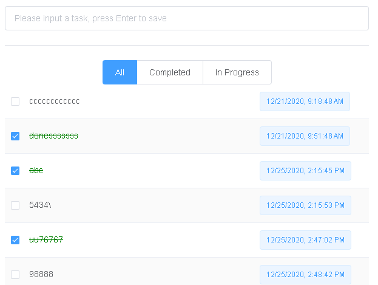

# 1. TODO程序的基于Vue3.0的前端实现
## 1.1. 概要
前端Vue3.0入手项目，实现一个TODO程序，前端采用Vue3.0，后端采用Spring Boot实现。 后端实现参考[https://github.com/jackniu81/todo-app/tree/main/todo-api](https://github.com/jackniu81/todo-app/tree/main/todo-api)， 本文着重前端实现。国内比较流行的element，针对Vue3.0的实现，叫做element plus，目前处于Beta阶段，也稍稍试一下。

## 1.2. 目的
1. Vue3.0 和element-plus UI框架的集成
2. 使用axios和API集成
3. Vue3.0中使用Typescript

## 1.3. 主要功能
实现TODO程序，数据库保存在MySQL数据库。
1. 新建task
2. 更改task的状态
3. 客户端可以根据状态过滤task列表
4. 和真实API交互。



## 1.4. 环境
1. Vue v3.0
2. @vue/cli v4.5.9
3. element-plus v1.0.1-beta.11 (element UI 的Vue3.0 版本)
4. node.js v12.18.2
5. npm v6.14.5

# 2. 代码实现
## 2.1. 创建Vue3.0项目
使用@vue/cli, 创建一个Vue3.0的项目。
```npm
# 安装 Vue CLI。如果已安装，跳过此步骤
npm install -g @vue/cli

# 创建项目
vue create todo-vue3
```
## 2.2. 引入 element-plus 
安装
```
npm install element-plus --save
```

在 main.js 中引入 ElementPlus
```javascript
import { createApp } from 'vue';
import ElementPlus from 'element-plus';
import 'element-plus/lib/theme-chalk/index.css';
import App from './App.vue';

const app = createApp(App);
app.use(ElementPlus);
app.mount('#app');
```

引入ElementPlus后，可以随便加些控件测试一下。 如
```html
<el-button type="primary" icon="el-icon-search">搜索</el-button>
```
## 2.3. 引入axios用于api数据读取
在 main.js 中引入
```javascript
import axios from 'axios'
import VueAxios from 'vue-axios'

createApp(App)
  .use(ElementPlus)
  .use(router)
  .use(VueAxios, axios)
  .mount("#app");
```

# 3. 核心代码
```html
<template>
  <div class="container">
    <div class="home">
      <el-input
        placeholder="Please input a task, press Enter to save"
        @keyup.enter="createTask"
        v-model="input"
      ></el-input>
      <el-divider></el-divider>
      <el-radio-group v-model="taskFilter">
        <el-radio-button label="All"></el-radio-button>
        <el-radio-button label="Completed"></el-radio-button>
        <el-radio-button label="In Progress"></el-radio-button>
      </el-radio-group>
      <el-table
        :data="taskList"
        stripe
        style="width: 100%"
        :show-header="false"
        :row-class-name="tableRowClassName"
      >
        <el-table-column prop="completed" width="30">
          <template #default="scope">
            <el-checkbox
              v-model="scope.row.completed"
              @change="updateComplete(scope.row)"
            >
              {{ scope.row.completed }}
            </el-checkbox>
          </template>
        </el-table-column>
        <el-table-column prop="content" width="380"> </el-table-column>
        <el-table-column>
          <template #default="scope"
            ><el-tag>{{
              new Date(scope.row.editTime).toLocaleString()
            }}</el-tag>
          </template>
        </el-table-column>
      </el-table>
    </div>
  </div>
</template>

<script lang="ts">
import { defineComponent, ref } from "vue";
import { Task } from "@/types";

const taskUrl = "http://localhost:8080/todo-api/v1/tasks/";

export default defineComponent({
  name: "Home",
  components: {},
  data() {
    return {
      input: ref(""),
      tasks: new Array<Task>(),
      taskFilter: "All",
    };
  },
  mounted() {
    this.loadTasks();
  },
  methods: {
    loadTasks() {
      this.axios
        .get(taskUrl)
        .then((response) => {
          this.tasks = response.data;
        })
        .catch((err) => console.log("Error loading podcasts: " + err));
    },
    /**
     * get row class for completed task
     */
    tableRowClassName(data: any) {
      const task: Task = data.row;
      return task.completed ? "row-done" : "";
    },
    updateComplete(task: Task) {
      this.axios
        .put(taskUrl + task.id, task)
        .then((response) => {
          console.log("Update Task: ", response.data);
          this.input = ref("");
        })
        .catch((err) => console.log("Update task error: " + err));
    },
    createTask(ev: any) {
      const content = ev.target.value.trim();

      if (!content) return;

      this.axios
        .post(taskUrl, {
          completed: false,
          content: content,
        })
        .then((response) => {
          console.log("Creat Task: ", response.data);
          this.input = ref("");
          return this.loadTasks();
        })
        .catch((err) => console.log("Creat task error: " + err));
    },
  },
  computed: {
    taskList(): Array<Task> {
      const list = this.tasks;
      if (this.taskFilter === "All") return list;
      else
        return list.filter(
          (p: Task) => p.completed == (this.taskFilter == "Completed")
        );
    },
  },
});
</script>
```
```css
<style scoped>
.home {
  width: 600px;
}
.container {
  display: flex;
  justify-content: center;
}

.el-table /deep/ .row-done {
  text-decoration: line-through;
  color: green;
}
</style>

```

# 4. 总结
1. Vue3.0对Typescript支持不错，但是感觉还是没有Angular支持的完美。比如vue的HTML中，没有类型、属性提示；
2. element-plus提供的控件很多，目前处于beta版的开发中，而且也是使用typescript重写的，值得读一读源码；

代码地址：[https://github.com/jackniu81/todo-app/todo-vue3](https://github.com/jackniu81/todo-app/todo-vue3)

# 5. 代码安装、执行

## 5.1. Project setup
```
npm install
```

### 5.1.1. Prepare TODO API
Refer to [https://github.com/jackniu81/todo-app/tree/main/todo-api](https://github.com/jackniu81/todo-app/tree/main/todo-api)
### 5.1.2. Compiles and hot-reloads for development
```
npm run serve
```
Open chrome, http://localhost:4300